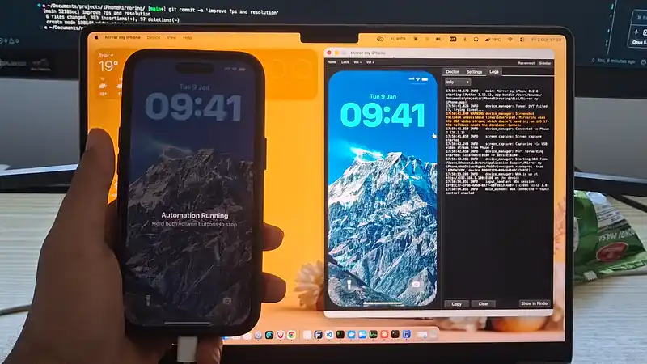

# Mirror my iPhone (hardened fork)

**See and control your iPhone from your Mac over USB, even in the EU, and optionally let AI agents use it.** A smooth 60 FPS mirror you use with your mouse and trackpad.

This is a security-hardened fork of [bhuwanadhikari/Mirror-my-iPhone](https://github.com/bhuwanadhikari/Mirror-my-iPhone) by Bhuwan Adhikari. It keeps the app's features and makes sure nobody else (other programs on the Mac, websites, devices on your network, or anyone upstream) can control the iPhone or slip in code without review. See [what changed](#security-changes-in-this-fork) and [SECURITY.md](SECURITY.md) for the threat model.




## Install

You need a Mac with macOS 13 or later, an iPhone with a USB data cable, Xcode (for touch control) and Python 3.12 (`brew install python@3.12`).

```bash
git clone https://github.com/Aresdgi/mirror-my-iphone.git
cd mirror-my-iphone
packaging/build_app.sh
cp -R "dist/Mirror my iPhone.app" /Applications/
open "/Applications/Mirror my iPhone.app"
```

Nothing is downloaded while building. On the first launch the app opens Terminal once to create its Python environment, installing only the exact packages pinned by SHA-256 in `requirements.lock`. Plug in your iPhone, tap **Trust**, and allow camera access when macOS asks (that's how the iPhone's screen reaches your Mac). The built-in Doctor walks you through the rest.

## Security changes in this fork

| Area | Original | This fork |
|---|---|---|
| WebDriverAgent on the Mac | Forwarded to `127.0.0.1:8100`, open to any local program or web page, with no authentication | Reached over usbmux from inside the app; no port is opened on the Mac |
| WebDriverAgent on the iPhone | Listened on every interface, Wi-Fi included, with `Access-Control-Allow-Origin: *`; the MJPEG screen stream (port 9100) too | Bound to the iPhone's loopback (`USE_IP=127.0.0.1`), the MJPEG stream as well (a one-line patch); the app refuses to use a WDA that reports any other address |
| Port 8100 | `kill -9` of every process with a socket on it | No port, so nothing to kill |
| Developer tunnel | Started `tunneld` as root (from a user-writable venv), logging to a fixed path in `/tmp`; never stopped | Removed |
| Python dependencies | Lower bounds only (`>=`), whatever PyPI served | `requirements.lock`: 113 packages pinned to exact versions and SHA-256, installed with `--require-hashes`, wheels only (one source package, built with a hash-pinned setuptools) |
| WebDriverAgent source | Cloned by tag; the app built any `WebDriverAgent.xcodeproj` it found (environment variable, `~/WebDriverAgent`, Spotlight) | One pinned commit of `appium/WebDriverAgent` (v16.13.6, `9d1d17ddb59e`) plus this fork's patch, verified after download and before every build; only the app's own copy is built |
| Agent API, MCP, CLI device control | Always on; token reused forever | Off until you turn on Settings › "Allow AI agents and scripts to control the iPhone"; a new token every start; `api.json` deleted on quit |
| Quitting | Terminated xcodebuild | Ends the WDA test run, checks over USB that WDA no longer answers on the iPhone, and stops a WDA left over by a crash on the next launch |
| Logs | UDID, iPhone name, signing team, certificate email, Wi-Fi IP | Redacted; log files readable only by you |
| Python environment | `$MIRROR_MY_IPHONE_VENV`, Homebrew Caskroom paths, or Application Support | Only `~/Library/Application Support/Mirror my iPhone/venv` |
| Distribution | Homebrew cask from the original author's releases; release scripts | Removed; you build from your own checkout |

## Let Claude use your iPhone (optional)

Agent control is **off by default**. To use it, open the app's Settings and turn on **Allow AI agents and scripts to control the iPhone**, then:

```bash
claude mcp add --scope user mirror-my-iphone -- "/Applications/Mirror my iPhone.app/Contents/Resources/bin/mirror-my-iphone" mcp
```

Then ask something like *"Open Settings on my iPhone and turn on Dark Mode"*. Claude takes screenshots, reads what's on screen, and taps, swipes and types its way there, and you watch every touch on the mirrored screen as a blue dot. While agent control is on, the status bar says so, and any program you run can read the token and control the iPhone; turn it off when you're done.

## "iPhone Mirroring is not available in your country or region"?


That's what Apple's iPhone Mirroring shows across the EU, where Apple has switched it off, citing the Digital Markets Act (DMA). Mirror my iPhone doesn't rely on it: it reads the screen over USB like QuickTime does and taps through Apple's own developer tools.

## FAQ

**Do I need a paid Apple Developer account or a jailbreak?**
No. Touch control works with a free Apple ID in Xcode and Developer Mode on the iPhone. Mirroring alone needs neither.

**Does it work wirelessly?**
No, it needs a USB cable that carries data. That's also why nothing on your network can reach it.

**Which Macs and iPhones does it work with?**
Macs with macOS 13 Ventura or later (Apple silicon and Intel). Any iPhone that QuickTime Player can show over USB should work. The screenshot fallback (when the USB video stream isn't available) only works up to iOS 16, because this fork doesn't start the root developer tunnel.

**Can I type with my Mac keyboard?**
Not yet, and double tap isn't supported either: a double click arrives as two separate taps.

---

## Technical details

### Setup checklist (the Doctor)

The Doctor opens on first launch; run it again from Help › Run Doctor. Mirroring needs only the first two rows.

| Check | Needed for | How |
|---|---|---|
| iPhone connected via USB, Mac trusted | Mirroring | A data cable; tap **Trust** on the iPhone |
| Camera access for Mirror my iPhone | Mirroring | macOS treats the iPhone's screen stream like a camera and asks once |
| Developer Mode on the iPhone | Touch control | Settings › Privacy & Security › Developer Mode (the Doctor can reveal the option) |
| Xcode and an Apple ID in Xcode | Touch control | App Store; Xcode › Settings › Accounts (a free Apple ID works) |
| WebDriverAgent | Touch control | The Doctor downloads the pinned commit and verifies it; the app builds it, installs it on the iPhone and starts it |
| Developer trusted, UI Automation on | Touch control | Settings › General › VPN & Device Management › Trust; Settings › Developer › Enable UI Automation |

### Controls

| Mac | iPhone |
|---|---|
| Click | Tap |
| Click and hold, or right-click | Long press |
| Drag | Swipe along the same path |
| Scroll wheel / two-finger scroll | Swipe in the scroll direction |
| ⇧⌘H / ⌘L | Home / Lock |
| ⌘0 / ⌘+ / ⌘− | Actual size / larger / smaller window |
| ⌃⌘S | Show or hide the sidebar (Doctor, Settings, Logs) |

### Agent API

While agent control is on, the app serves an HTTP API on `127.0.0.1`. The MCP server (`mirror-my-iphone mcp`) and the CLI's device commands are clients of it. Coordinates are iPhone points (393 × 852 on an iPhone 15), which are also the pixels of a default screenshot, with (0, 0) at the top left.

| MCP tool | CLI | HTTP |
|---|---|---|
| `screenshot` | `screenshot [FILE] [--scale 3]` | `GET /v1/screenshot?scale=&format=png\|jpeg` |
| `describe_ui` | `ui [--json]` | `GET /v1/ui`: elements with label, value and the point to tap |
| `tap`, `double_tap` | `tap X Y`, `double-tap X Y` | `POST /v1/tap`, `/v1/double_tap` `{"x", "y"}` |
| `long_press` | `long-press X Y [--duration S]` | `POST /v1/long_press` `{"x", "y", "duration"}` |
| `swipe` | `swipe X1 Y1 X2 Y2 [--duration S]` | `POST /v1/swipe` `{"x1", "y1", "x2", "y2", "duration"}` |
| `type_text` | `type TEXT` | `POST /v1/type` `{"text"}`, into the focused field; `\n` presses Return |
| `press_button` | `button home\|lock\|volume-up\|volume-down` | `POST /v1/button` `{"name"}` |
| `open_app`, `list_apps` | `open-app BUNDLE_ID`, `apps` | `POST /v1/open_app` `{"bundle_id"}`, `GET /v1/apps` |
| `device_info` | `info` | `GET /v1/info` |

Every request needs the token from `~/Library/Application Support/Mirror my iPhone/api.json`, which only your user account can read. It changes every time the API starts, and the file is deleted when the API stops. The API refuses requests from web pages.

```bash
API="$HOME/Library/Application Support/Mirror my iPhone/api.json"
URL=$(plutil -extract url raw -o - "$API") TOKEN=$(plutil -extract token raw -o - "$API")
curl -H "Authorization: Bearer $TOKEN" "$URL/v1/screenshot" -o screen.png
curl -H "Authorization: Bearer $TOKEN" -d '{"x": 196, "y": 400}' "$URL/v1/tap"
```

### Limitations

- The iPhone's screen has to be on; the picture pauses while it sleeps. Raise Settings › Display & Brightness › Auto-Lock to keep it awake.
- A swipe plays on the iPhone when you release the mouse: WebDriverAgent only accepts whole gestures.
- With a free Apple ID, the WebDriverAgent signing profile lasts 7 days; the app signs it again automatically.

### How it works

- **Screen:** an AVFoundation USB video stream at up to 60 FPS, the same one QuickTime Player records. While it runs, iOS shows a clean status bar and may route its audio to the Mac. Fallback: the DVT Screenshot Service over pymobiledevice3 (~20 FPS; iOS 16 and earlier).
- **Touch:** mouse positions are converted to iPhone points and sent as W3C actions to [WebDriverAgent](https://github.com/appium/WebDriverAgent), which the app builds and runs with `xcodebuild`, signed with your Apple ID. The app talks to it through usbmuxd from its own process (`usbmux_http.py`); on the iPhone, WDA listens on loopback only.
- **Agents:** the agent API runs inside the app on 127.0.0.1:8101 (or a free port, written to `api.json`), only while turned on. Agent gestures share WebDriverAgent's queue with your mouse.
- **USB:** pymobiledevice3 (usbmux and lockdown). **UI:** PyQt6, run in the app's own process by a small native launcher.

### Troubleshooting

Start with the Doctor. The Logs tab and `~/Library/Logs/Mirror my iPhone` show what the app, pymobiledevice3 and xcodebuild are doing (with device IDs, names and addresses redacted).

- **Frozen picture or 0 FPS:** the iPhone's display is off. Wake and unlock it.
- **Low FPS, capture mode `screenshots`:** the USB stream isn't available. Allow camera access in System Settings › Privacy & Security › Camera.
- **Touch doesn't work:** the banner above the phone says why. The first WebDriverAgent build takes a few minutes; afterwards trust the developer on the iPhone (Settings › General › VPN & Device Management).
- **"The WebDriverAgent copy has been modified":** something changed the app's copy. Download it again from the Doctor.

### Update, uninstall and the command line

```bash
# Update: review what changed before building
git fetch origin && git log -p HEAD..origin/main
git merge origin/main && packaging/build_app.sh
rm -rf "/Applications/Mirror my iPhone.app" && cp -R "dist/Mirror my iPhone.app" /Applications/

# Uninstall (then delete WebDriverAgentRunner from the iPhone)
rm -rf "/Applications/Mirror my iPhone.app" "$HOME/Library/Application Support/Mirror my iPhone" "$HOME/Library/Logs/Mirror my iPhone"

# Optional: the mirror-my-iphone command, without sudo (add ~/.local/bin to your PATH)
mkdir -p ~/.local/bin
ln -sf "/Applications/Mirror my iPhone.app/Contents/Resources/bin/mirror-my-iphone" ~/.local/bin/mirror-my-iphone
```

To look at changes in the original project, `git fetch upstream && git log -p main..upstream/main`, and merge only what you've reviewed.

### Development

Run from source without building the app (macOS then asks for camera access for your terminal):

```bash
bash setup.sh                 # creates .venv from the hash-pinned lock files
.venv/bin/python3 main.py     # the app
.venv/bin/python3 cli.py doctor
```

- **Dependencies:** edit `requirements.in`, then regenerate the lock with Python 3.12 and pip-tools: `pip-compile --generate-hashes --allow-unsafe --strip-extras --no-emit-index-url --output-file requirements.lock requirements.in`. Review the diff before committing.
- **WebDriverAgent:** to move to another release, change `WDA_VERSION` and `WDA_COMMIT` in `paths.py` and the `WebDriverAgent` submodule to the same commit, check that the patches in `wda-patches/` still apply, and update the SHA-256 of the patched files in `wda_project.PATCHED_FILES`.
- `packaging/build_app.sh` builds `dist/Mirror my iPhone.app`. The app's Python environment lives outside the bundle, in `~/Library/Application Support/Mirror my iPhone/venv`.

## Credits

- [Bhuwan Adhikari](https://github.com/bhuwanadhikari), who wrote [Mirror my iPhone](https://github.com/bhuwanadhikari/Mirror-my-iPhone), which this fork is based on.
- [iPhoneMirroring](https://github.com/Dennisjoch/iPhoneMirroring), the open-source project Mirror my iPhone started from.
- [WebDriverAgent](https://github.com/appium/WebDriverAgent) (Appium) and [pymobiledevice3](https://github.com/doronz88/pymobiledevice3).

MIT licensed; see [LICENSE](LICENSE).
