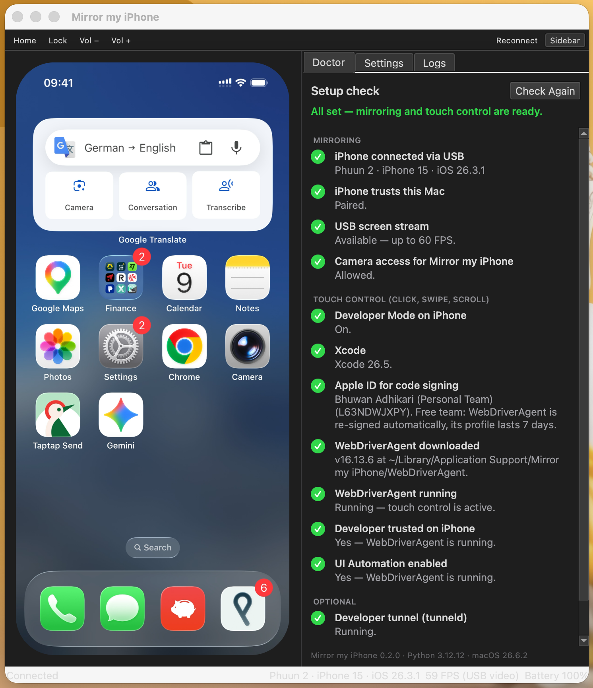
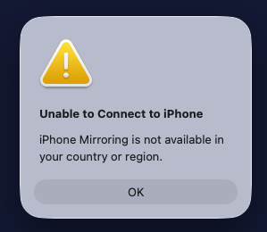

# Mirror my iPhone

**iPhone Mirroring for your Mac, even in the EU.** See your iPhone on your Mac at a smooth 60 FPS and use it with your mouse and trackpad: tap, swipe, scroll, Home, Lock and volume. Free and open source.



## Install

You need a Mac with macOS 13 or later, an iPhone with a USB data cable, Xcode (or just `xcode-select --install`) and Python 3.10+ (`brew install python@3.12`).

```bash
git clone https://github.com/bhuwanadhikari/Mirror-my-iPhone.git
cd Mirror-my-iPhone
packaging/build_app.sh
cp -R "dist/Mirror my iPhone.app" /Applications/
open "/Applications/Mirror my iPhone.app"
```

The first launch takes about a minute to set itself up. Plug in your iPhone, tap **Trust**, and allow camera access when macOS asks (that's how the iPhone's screen reaches your Mac). The built-in Doctor walks you through the rest. A Homebrew install is coming soon.

## "iPhone Mirroring is not available in your country or region"?



That's what Apple's iPhone Mirroring shows across the EU, where Apple has switched it off, citing the Digital Markets Act (DMA). Mirror my iPhone doesn't rely on it: it reads the screen over USB like QuickTime does and taps through Apple's own developer tools, so it works in Germany, France, Italy, Spain, the Netherlands and everywhere else.

## Why Mirror my iPhone

- **Smooth 60 FPS:** scrolling, animations and videos look natural
- **Full control:** click to tap, drag to swipe, scroll with the trackpad, click and hold for a long press
- **Buttons and sound:** Home, Lock and volume from the toolbar or keyboard; iPhone audio plays on your Mac
- **Guided setup:** the Doctor checks your iPhone and Mac and shows how to fix anything missing, often with one click
- **Private and free:** everything stays on your Mac and the USB cable; no account, no telemetry, MIT licensed

| | Mirror my iPhone | Apple iPhone Mirroring | QuickTime / AirPlay |
|---|---|---|---|
| Works in the EU | ✅ | ❌ | ✅ |
| Control with mouse and trackpad | ✅ | ✅ | ❌ View only |
| Connection | USB | Wireless | USB / Wi-Fi |
| Price | Free, open source | Built in | Built in |

## FAQ

**Is there an iPhone Mirroring alternative that works in the EU?**
Yes: Mirror my iPhone mirrors and controls your iPhone from a Mac in any country.

**Do I need a paid Apple Developer account or a jailbreak?**
No. Touch control works with a free Apple ID in Xcode and Developer Mode on the iPhone. Mirroring alone needs neither.

**Does it work wirelessly?**
No, it needs a USB cable that carries data.

**Which Macs and iPhones does it work with?**
Macs with macOS 13 Ventura or later (Apple silicon and Intel). Tested with an iPhone 15 on iOS 26 and macOS 26 Tahoe; any iPhone that QuickTime Player can show over USB should work.

**Can I type with my Mac keyboard?**
Not yet, and double tap isn't supported either: a double click arrives as two separate taps.

---

## Technical details

### Setup checklist (the Doctor)

The Doctor opens on first launch; run it again from Help › Run Doctor. Mirroring needs only the first two rows.

| Check | Needed for | How |
|---|---|---|
| iPhone connected via USB, Mac trusted | Mirroring | A data cable; tap **Trust** on the iPhone |
| Camera access for Mirror my iPhone | Mirroring | macOS treats the iPhone's screen stream like a camera and asks once |
| Developer Mode on the iPhone | Touch control | Settings › Privacy & Security › Developer Mode (the Doctor can reveal the option) |
| Xcode and an Apple ID in Xcode | Touch control | App Store; Xcode › Settings › Accounts (a free Apple ID works) |
| WebDriverAgent | Touch control | The Doctor downloads it; the app builds it, installs it on the iPhone and starts it |
| Developer trusted, UI Automation on | Touch control | Settings › General › VPN & Device Management › Trust; Settings › Developer › Enable UI Automation |
| Developer tunnel (`tunneld`) | Optional: screenshot fallback on iOS 17+ | The Doctor starts it (asks for your password) |

### Controls

| Mac | iPhone |
|---|---|
| Click | Tap |
| Click and hold, or right-click | Long press |
| Drag | Swipe along the same path |
| Scroll wheel / two-finger scroll | Swipe in the scroll direction |
| ⇧⌘H / ⌘L | Home / Lock |
| ⌘0 / ⌘+ / ⌘− | Actual size / larger / smaller window |
| ⌃⌘S | Show or hide the sidebar (Doctor, Settings, Logs) |

### Limitations

- The iPhone's screen has to be on; the picture pauses while it sleeps. Raise Settings › Display & Brightness › Auto-Lock to keep it awake.
- A swipe plays on the iPhone when you release the mouse: WebDriverAgent only accepts whole gestures.
- With a free Apple ID, the WebDriverAgent signing profile lasts 7 days; the app signs it again automatically.

### How it works

- **Screen:** an AVFoundation USB video stream at up to 60 FPS, the same one QuickTime Player records. While it runs, iOS shows a clean status bar (09:41, full battery) and may route its audio to the Mac. Fallback: the DVT Screenshot Service over pymobiledevice3 (~20 FPS; needs the developer tunnel on iOS 17+).
- **Touch:** mouse positions are converted to iPhone points and sent as W3C actions to [WebDriverAgent](https://github.com/appium/WebDriverAgent) (port 8100), which the app builds and runs with `xcodebuild`, signed with the first Apple ID in Xcode.
- **USB:** pymobiledevice3 (usbmux and lockdown). **UI:** PyQt6, run in the app's own process by a small native launcher.

### Troubleshooting

Start with the Doctor. The Logs tab and `~/Library/Logs/Mirror my iPhone` show what the app, pymobiledevice3 and xcodebuild are doing.

- **Frozen picture or 0 FPS:** the iPhone's display is off. Wake and unlock it.
- **Low FPS, capture mode `screenshots`:** the USB stream isn't available. Allow camera access in System Settings › Privacy & Security › Camera.
- **Touch doesn't work:** the banner above the phone says why. The first WebDriverAgent build takes a few minutes; afterwards trust the developer on the iPhone (Settings › General › VPN & Device Management).

### Update, uninstall and the command line

```bash
# Update
git pull && packaging/build_app.sh
rm -rf "/Applications/Mirror my iPhone.app" && cp -R "dist/Mirror my iPhone.app" /Applications/

# Uninstall (then delete WebDriverAgentRunner from the iPhone)
rm -rf "/Applications/Mirror my iPhone.app" "$HOME/Library/Application Support/Mirror my iPhone" "$HOME/Library/Logs/Mirror my iPhone"

# Optional: the mirror-my-iphone command (doctor, tunnel, logs)
sudo mkdir -p /usr/local/bin
sudo ln -sf "/Applications/Mirror my iPhone.app/Contents/Resources/bin/mirror-my-iphone" /usr/local/bin/mirror-my-iphone
```

### Development

Run from source without building the app (macOS then asks for camera access for your terminal):

```bash
bash setup.sh                 # creates .venv and installs the dependencies
.venv/bin/python3 main.py     # the app
.venv/bin/python3 cli.py doctor
```

`packaging/build_app.sh` builds `dist/Mirror my iPhone.app` and its zip. The app's Python environment lives outside the bundle: in the Caskroom for Homebrew installs, otherwise in `~/Library/Application Support/Mirror my iPhone/venv`. To release, bump `__version__` in `version.py`, commit, and run `packaging/release.sh`; it builds the zip, updates `Casks/mirror-my-iphone.rb`, pushes and creates the GitHub release. This repository is its own Homebrew tap.
